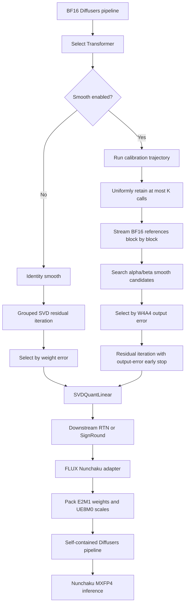

# SVDQuant MXFP4 Overview

## Purpose

SVDQuant is a structural transform applied before the final AutoRound quantizer.
It decomposes each selected Linear into an MXFP4 residual branch and a BF16
low-rank branch:

```text
W ~= W_residual + W_up @ W_down
```

- `W_residual`: quantized as MXFP4 W4A4.
- `W_up @ W_down`: retained in BF16 to absorb outliers and quantization error.
- The final residual quantizer can be RTN or SignRound.
- SVDQuant residual iteration itself always uses RTN QDQ.

## End-to-End Flow



## Two Operating Modes

| Item | No smooth | Smooth |
| --- | --- | --- |
| Calibration | Not required | Required |
| Smooth factor | Identity | Alpha/beta grid search |
| Residual score | Weight reconstruction error | Evaluation-module output error |
| Activation QDQ during search | No | MXFP4 |
| Compressor | `ZeroShotCompressor` | `CalibratedZeroShotCompressor` for RTN |
| Main use | Fast baseline | Quality-oriented quantization |

## FLUX Grouping

Projections sharing an input are processed together so they can share a smooth
factor and low-rank down matrix.

- Double-stream Q/K/V and added Q/K/V form separate groups.
- FFN and context FFN projections are grouped according to their input.
- Single-stream Q/K/V and `proj_mlp` form `parallel_qkv_mlp`.
- Unknown architectures fall back to per-Linear processing.

Grouping also matches the fusion expected by the Nunchaku FLUX runtime.

## Smooth Search

For activation span `x_span` and weight span `w_span`, a candidate is:

```text
scale = x_span^alpha / w_span^beta
runtime_smooth = 1 / scale
```

With `smooth_num_grids=20`, 39 candidates are evaluated: identity, 19
activation-only candidates, and 19 activation/weight candidates.

Each candidate uses the actual deployment approximation:

```text
x_hat = x * runtime_smooth
y_hat = MXFP4_QDQ(W_residual) * MXFP4_QDQ(x_hat)
        + W_up * (W_down * x_hat)
```

The result is compared with the BF16 reference output. Weight and activation
QDQ both use group size 32 and the Nunchaku UE8M0 rule:

```text
shared_exponent = ceil(log2(max_abs / 6))
```

## Residual Iteration

Starting with `Q_0 = 0`, iteration `t` performs:

```text
L_t = rank-r SVD(W_hat - Q_(t-1))
R_t = W_hat - L_t
Q_t = MXFP4_QDQ(R_t)
```

- No-smooth mode selects the smallest weight reconstruction error.
- Smooth mode selects the smallest calibration output error.
- Equal or lower error continues the loop.
- With early stop enabled, the first worse candidate stops the loop.
- No-smooth weight error often decreases monotonically, so it may reach the
  configured iteration limit even when early stop is enabled.

## Calibration Memory Control

The complete `nsamples * diffusion_steps` trajectory must still execute, but
only a deterministic uniform subset of at most `K` calls is copied to CPU.

- `K` is controlled by `--svdquant_smooth_max_calibration_calls`.
- Non-selected calls are not copied and are released after forward.
- FLUX caches only the double-stream and single-stream entry blocks.
- BF16 reference outputs propagate to the next block; quantized outputs do not.
- Both `encoder_hidden_states` and `hidden_states` are preserved.
- Current-block buffers are released before processing the next block.

Use `K=16` on the 120 GB RAM machine. The default `K=128` targets larger hosts.

## Export and Runtime

The FLUX adapter fuses and renames projections, packs residual weights as E2M1
and scales as UE8M0, and preserves the low-rank and smooth tensors in BF16.
AdaNorm uses W4A16 INT4; required RMSNorm and top-level tensors remain BF16.

The exported directory is a self-contained Diffusers pipeline:

```text
output/
  model_index.json
  scheduler/
  tokenizer/
  tokenizer_2/
  text_encoder/       # BF16
  text_encoder_2/     # BF16
  vae/                # BF16
  transformer/
    config.json
    diffusion_pytorch_model.safetensors  # Nunchaku MXFP4
```

The transformer onefile contains packed MXFP4 tensors and metadata identifying
`NunchakuFluxTransformer2dModel`, rank, group size 32, and UE8M0 scales. A
standard FLUX.1-dev artifact contains 2,604 tensors.

## Validation Completed

- SVDQuant transform, grouping, smooth, residual, CLI, and exporter tests.
- MXFP4 pack/unpack and onefile schema checks.
- Nunchaku kernel-versus-QDQ numerical comparison.
- Metadata-based directory onefile loading.
- Self-contained FLUX pipeline loading and 20/50-step image generation.
- Coherent no-smooth and smooth MXFP4 smoke images on RTX 5090D.

## Remaining Work

- Run larger paired BF16/NVFP4/MXFP4 quality evaluations.
- Reduce the measured ImageReward gap to BF16.
- Fix Nunchaku's early path-based `fp4` warning; metadata already corrects the
  final dispatch to the MXFP4 kernel.
- Evaluate optional MXFP4 range/scale search separately from strict reference
  behavior.
