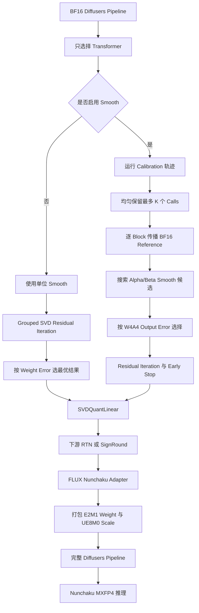

# SVDQuant MXFP4 流程概览

## 目标

SVDQuant 是最终量化前的结构变换，不是一种新的数据类型。它把目标
Linear 拆成 MXFP4 residual 分支和 BF16 low-rank 分支：

```text
W ~= W_residual + W_up @ W_down
```

- `W_residual`：使用 MXFP4 W4A4 量化。
- `W_up @ W_down`：保持 BF16，吸收离群值和量化误差。
- 最终 residual 分支可以交给 RTN 或 SignRound。
- SVDQuant 内部的 residual iteration 固定使用 RTN QDQ。

## 完整流程



## 两种工作模式

| 项目 | No Smooth | Smooth |
| --- | --- | --- |
| Calibration | 不需要 | 需要 |
| Smooth factor | 全 1 | Alpha/Beta 网格搜索 |
| Residual 评分 | Weight reconstruction error | Evaluation-module output error |
| 搜索时的 activation QDQ | 无 | MXFP4 |
| RTN compressor | `ZeroShotCompressor` | `CalibratedZeroShotCompressor` |
| 主要用途 | 快速基线 | 质量优先 |

## FLUX 分组

共享输入的 projections 会一起处理，从而共享 smooth factor 和 low-rank
down matrix。

- Double-stream Q/K/V 为一组，added Q/K/V 为另一组。
- FFN 和 context FFN 按输入关系分组。
- Single-stream Q/K/V 与 `proj_mlp` 组成 `parallel_qkv_mlp`。
- 未注册 adapter 的模型退回逐 Linear 处理。

这些分组同时匹配 Nunchaku FLUX runtime 的 fusion 结构。

## Smooth 搜索

根据 activation span `x_span` 和 weight span `w_span` 构造候选：

```text
scale = x_span^alpha / w_span^beta
runtime_smooth = 1 / scale
```

当 `smooth_num_grids=20` 时，共计算 39 个候选：

- 1 个 identity 候选。
- 19 个 activation-only 候选。
- 19 个 activation/weight 联合候选。

每个候选都使用接近部署端的 W4A4 路径：

```text
x_hat = x * runtime_smooth
y_hat = MXFP4_QDQ(W_residual) * MXFP4_QDQ(x_hat)
        + W_up * (W_down * x_hat)
```

候选输出与 BF16 reference output 比较。Weight 和 activation QDQ 均使用
group size 32，并采用 Nunchaku UE8M0 scale 规则：

```text
shared_exponent = ceil(log2(max_abs / 6))
```

## Residual Iteration

从 `Q_0 = 0` 开始，第 `t` 次迭代执行：

```text
L_t = rank-r SVD(W_hat - Q_(t-1))
R_t = W_hat - L_t
Q_t = MXFP4_QDQ(R_t)
```

- No-smooth：选择 weight reconstruction error 最小的结果。
- Smooth：选择 calibration output error 最小的结果。
- 误差相等或下降时继续迭代。
- 开启 early stop 后，第一次出现误差上升就停止。
- No-smooth 的 weight error 经常单调下降，因此可能跑满迭代上限。

## Calibration 内存控制

完整的 `nsamples * diffusion_steps` 轨迹仍然需要执行，但只把最多 `K`
个确定性均匀采样的 calls 复制到 CPU。

- `K` 由 `--svdquant_smooth_max_calibration_calls` 控制。
- 未选中的 calls 不复制到 CPU，forward 后自然释放。
- 最终量化器为 SignRound 时，选中的 calls 由 smooth 搜索、residual
  output-error 评分和 SignRound 优化共同使用。
- No-smooth SignRound 保持原有 calibration 行为。
- FLUX 只缓存 double-stream 和 single-stream 两个入口 block。
- 两条路径都会把当前 block 的 BF16 reference output 传播给下一个 block。
- 最终 RTN 不传播 quantized output；最终 SignRound 会传播选中 calibration
  pool 对应的 quantized output。
- Double-stream 同时保留 `encoder_hidden_states` 和 `hidden_states`。
- 当前 block 完成后立即释放其临时 smooth 数据。

120 GB RAM 的机器建议设置 `K=16`；默认 `K=128` 适合更大内存机器。

## 导出与 Runtime

FLUX adapter 负责 fusion、重命名和 runtime schema 转换：

- Residual weight：E2M1，打包为 `int8`。
- Weight scale：UE8M0，保存为 `uint8`。
- Group size：32。
- Low-rank 和 smooth tensor：BF16。
- AdaNorm：W4A16 INT4。
- RMSNorm 和顶层必要参数：BF16。

最终产物是可独立加载的 Diffusers pipeline：

```text
output/
  model_index.json
  scheduler/
  tokenizer/
  tokenizer_2/
  text_encoder/       # BF16
  text_encoder_2/     # BF16
  vae/                # BF16
  transformer/
    config.json
    diffusion_pytorch_model.safetensors  # Nunchaku MXFP4
```

Transformer onefile 的 metadata 包含 Nunchaku model class、rank、group size
32 和 UE8M0 scale 配置。标准 FLUX.1-dev onefile 包含 2,604 个 tensors。

## 已完成验证

- SVDQuant transform、grouping、smooth、residual、CLI 和 exporter 测试。
- MXFP4 pack/unpack 和 onefile schema 检查。
- Nunchaku kernel 与 QDQ 数值对比。
- 基于 metadata 的 directory-onefile 加载。
- 完整 FLUX pipeline 加载和 20/50-step 出图。
- RTX 5090D 上 no-smooth 与 smooth MXFP4 均可生成正常图片。

## 后续工作

- 扩大 BF16、NVFP4、MXFP4 的配对质量评测。
- 继续缩小 MXFP4 与 BF16 的 ImageReward 差距。
- 修复 Nunchaku 读取 metadata 前产生的 `fp4` 误报警告；最终 kernel dispatch
  已经是 MXFP4。
- 将可选的 MXFP4 range/scale 搜索作为额外优化单独评估，不与严格参考流程混合。
